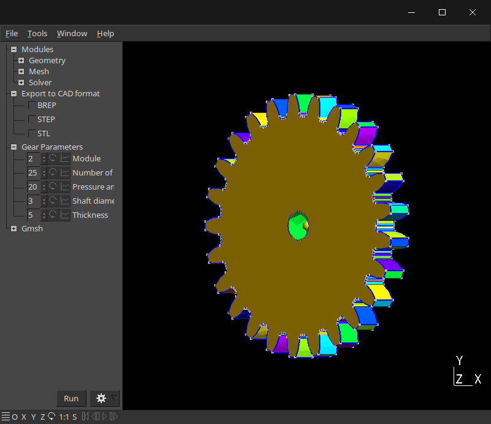

# gear-generator

Download the script here: [`Download Link`](https://github.com/EvokeMadness/gear-generator/releases/latest/download/gear-generator.zip)

# Summary
Gmsh geometry script using the OpenCASCADE CAD kernel.

- **What's Included:**
	- Options to change the following parameters:
		- Module
		- Number of teeth
		- Pressure angle
		- Shaft diameter
		- Thickness
	- Options to export the generated gear to the following CAD formats:
		- BREP
		- STEP
		- STL

# Usage
- Open the GEO file in Gmsh
- Adjust the available parameters
- To export, click the checkbutton next to the desired CAD format. Exported files can be found in the `exported/` folder.
- The exported file name will follow this naming convention: `'number_of_teeth'-tooth-gear.[brep/step/stl]`
- The checkbutton will toggle off once the export is done.

# Additional Information

- **Notes**
    - The following tutorial regarding involute spur gears was used in the creation of this script:
	    - **Creating Spur and Helical Gears - Tutorial - SOLIDWORKS**
	    > 
    - Future support for helical and worm gears is planned.
    - Future support for a variety of shaft designs is planned; including designs for Lego® Technic axles.
- **Warnings**
    - The `exported/` folder is required to be in the same directory as the script. Removing this folder will cause the script to fail.
    - This project is still a work-in-progress, and can still be further optimized.

